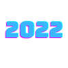
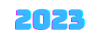
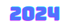

<h2 align="center">Hi, I am Dominik Wojnar - Full Stack Developer and Bitcoiner</h2>

  
  
  
  
  
  
  
  
  
  
  

<h2>Where you find me </h2>

 

<!--  -->

  
  

<h2>About me</h2>

 

  

  <ul>
    <li>🎋 I like to write web applications and websites in Typescript, React and Next JS.</li>
    <li>🧱 I am learing also .NET and Spring Boot</li>
    <li>🎒  Now I mainly focus on web application development</li>
    <li>💢  Software engineering is my passion  </li>
    <li>🤖I like to solve problems and find optimal solutions </li>
    <li>🏛I am currently working on a Next JS + Postgres project</li>
  </ul>

 

  

  <h2>Experience</h2>
    

      
      
      
3 months intership as web developer in Profiq Company

    

    

      
      
      
6 Months intership as web developer in Digiday company

    

    

      
      
      
Summer part-job as React developer in K2 Company

    

    

      
        
      

        <b>Currently I am working as full-stack developer in Aricoma</b>
         
        <b>I ma working in ASP .NET for CZECHTRADE</b>
        <ul>
          <li>REACT</li>
          <li>ASP .NET</li>
          <li>AZURE</li>
          <li>MICROSOFT POWER PLATFORMS</li>
        </ul>
      

    

